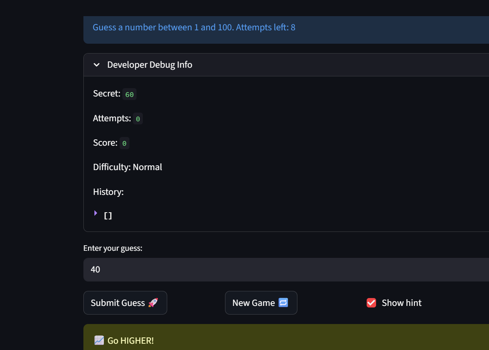

# 🎮 Game Glitch Investigator: The Impossible Guesser

## 🚨 The Situation

You asked an AI to build a simple "Number Guessing Game" using Streamlit.
It wrote the code, ran away, and now the game is unplayable. 

- You can't win.
- The hints lie to you.
- The secret number seems to have commitment issues.

## 🛠️ Setup

1. Install dependencies: `pip install -r requirements.txt`
2. Run the broken app: `python -m streamlit run app.py`

## 🕵️‍♂️ Your Mission

1. **Play the game.** Open the "Developer Debug Info" tab in the app to see the secret number. Try to win.
2. **Find the State Bug.** Why does the secret number change every time you click "Submit"? Ask ChatGPT: *"How do I keep a variable from resetting in Streamlit when I click a button?"*
3. **Fix the Logic.** The hints ("Higher/Lower") are wrong. Fix them.
4. **Refactor & Test.** - Move the logic into `logic_utils.py`.
   - Run `pytest` in your terminal.
   - Keep fixing until all tests pass!

## 📝 Document Your Experience

- [ ] Describe the game's purpose.
The first time I ran the game the hints were clearly wrong and seemed to be backwards. For example, it kept telling me to go lower multiple times even though the actual number had to be much higher. I guessed all the way down to 1 and the hint still said to go lower even though the range was 1–100. That made it obvious the hint logic was not working correctly.

Another issue I noticed was that the game did not properly restart when clicking the New Game button. The number of attempts would reset back to 8, but the game state itself did not fully restart. Sometimes the message “You already won” would still stay on the screen even after clicking New Game multiple times. At that point the game would not let me submit any more guesses.

I also noticed the attempts counter was inconsistent. On the first guess it sometimes did not reduce the number of attempts, so it looked like I still had all 8 tries left. After identifying these issues, I added tests to verify the fixes for both the hint logic and the restart behavior, and all the tests passed.
- [ ] Detail which bugs you found.
When I first ran the game, the hint system was clearly wrong. It kept telling me to go lower even when the number should have been higher, and I was able to guess all the way down to 1 while the hint still said to go lower even though the range was 1–100. This happened because the code was sometimes comparing the guess and the secret as strings instead of integers, which caused alphabetical comparisons instead of numeric ones. I also noticed that the logic for the hints was reversed in some cases, which made the feedback misleading.

Another bug was related to restarting the game. When I clicked the New Game button, the attempts would reset to 8 but the rest of the game state did not fully restart. Sometimes the message saying “You already won” would still stay on the screen and the game would not allow any new guesses. I also noticed that the attempts counter was inconsistent because the first guess sometimes did not reduce the number of attempts.

- [ ] Explain what fixes you applied.
To fix the hint problem, I corrected the comparison logic so that guesses and the secret number were always treated as integers instead of strings. This ensured that the comparisons were numeric and the hints would correctly say whether the guess was too high or too low. I also fixed the reversed hint logic so the feedback matched the actual comparison between the guess and the secret.

To fix the restart issues, I reorganized how the game state was created and reset. I moved all the setup logic into a function called build_new_game_state() and made sure it was only triggered through reset_game_state(). That function now only runs when the game starts for the first time or when the user clicks the New Game button.
## 📸 Demo

- [ ] The hints are now fixed

## 🚀 Stretch Features

- [ ] [If you choose to complete Challenge 4, insert a screenshot of your Enhanced Game UI here]
