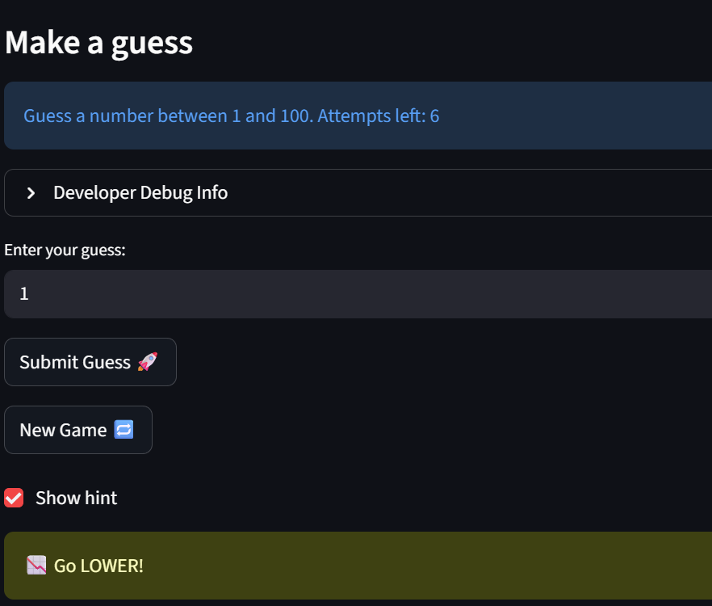

# 💭 Reflection: Game Glitch Investigator

Answer each question in 3 to 5 sentences. Be specific and honest about what actually happened while you worked. This is about your process, not trying to sound perfect.

## 1. What was broken when you started?

- What did the game look like the first time you ran it?
- List at least two concrete bugs you noticed at the start  
  (for example: "the secret number kept changing" or "the hints were backwards").

The hints were incorrect and seemed to be backwards for example they hint was to go lower multiple times but the number was actually much higher. I went all the way to 1 and the next hint was still go lower despite the range being from 1-100. 

- Output from Co-pilot
  In app.py. the current logic is reversed. If guess>secret, it return "Too High" but says "go Higher" It is backwards. 
  Secret is also converted into a string before checking  and then compares the numbers as strings instead of as numbers.

- Output from Claude
 Line 158-163   Lines 158–163 — the secret gets converted to a string on even      
When attempts is even, secret becomes a string like "42". Then check_guess is called with guess_int (an integer) vs a string secret. String comparison is alphabetical not numeric.

Co-pilot vs Claude 
Claude actually did not mention anything about the logic being reversed, it focused mainly on the int to string conversion

The game does not properly restart when you click the new game button.However the attempts restart back to 8. 

The number of attempts left after sometimes inaccurate. If you submit an annswer the first time the attempt is not counted and you still have the full 8 attempts left 

After you guess the number and restart the game, the attempts reset but the message "Yur already won" stays there despite already clicking new game multiple times. The game also does not restart or allow you submit any new attempts

---

## 2. How did you use AI as a teammate?

- Which AI tools did you use on this project (for example: ChatGPT, Gemini, Copilot)?
Claude and ChatGPT
- Give one example of an AI suggestion that was correct (including what the AI suggested and how you verified the result).
- Give one example of an AI suggestion that was incorrect or misleading (including what the AI suggested and how you verified the result).

---

## 3. Debugging and testing your fixes

- How did you decide whether a bug was really fixed?
- Describe at least one test you ran (manual or using pytest)  
  and what it showed you about your code.
- Did AI help you design or understand any tests? How?

---

## 4. What did you learn about Streamlit and state?

- In your own words, explain why the secret number kept changing in the original app.
- How would you explain Streamlit "reruns" and session state to a friend who has never used Streamlit?
- What change did you make that finally gave the game a stable secret number?

---

## 5. Looking ahead: your developer habits

- What is one habit or strategy from this project that you want to reuse in future labs or projects?
  - This could be a testing habit, a prompting strategy, or a way you used Git.
- What is one thing you would do differently next time you work with AI on a coding task?
- In one or two sentences, describe how this project changed the way you think about AI generated code.
