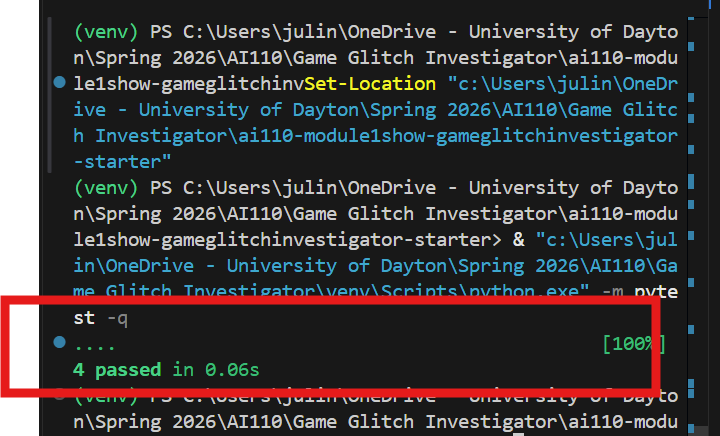

# 💭 Reflection: Game Glitch Investigator

Answer each question in 3 to 5 sentences. Be specific and honest about what actually happened while you worked. This is about your process, not trying to sound perfect.

## 1. What was broken when you started?

- What did the game look like the first time you ran it?
- List at least two concrete bugs you noticed at the start  
  (for example: "the secret number kept changing" or "the hints were backwards").

The hints were incorrect and seemed to be backwards for example they hint was to go lower multiple times but the number was actually much higher. I went all the way to 1 and the next hint was still go lower despite the range being from 1-100. 

- Output from Co-pilot
  In app.py. the current logic is reversed. If guess>secret, it return "Too High" but says "go Higher" It is backwards. 
  Secret is also converted into a string before checking  and then compares the numbers as strings instead of as numbers.

- Output from Claude
 Line 158-163   Lines 158–163 — the secret gets converted to a string on even      
When attempts is even, secret becomes a string like "42". Then check_guess is called with guess_int (an integer) vs a string secret. String comparison is alphabetical not numeric.

Co-pilot vs Claude 
Claude actually did not mention anything about the logic being reversed, it focused mainly on the int to string conversion

The game does not properly restart when you click the new game button.However the attempts restart back to 8. 

The number of attempts left after sometimes inaccurate. If you submit an annswer the first time the attempt is not counted and you still have the full 8 attempts left 

After you guess the number and restart the game, the attempts reset but the message "You already won" stays there despite already clicking new game multiple times. The game also does not restart or allow you submit any new attempts

---

Added tests to verify the two fixed for hints and restarting the game and all tests passed 

## 2. How did you use AI as a teammate?

- Which AI tools did you use on this project (for example: ChatGPT, Gemini, Copilot)?
I used Co-pilot, Claude and ChatGPT for this project
- Give one example of an AI suggestion that was correct (including what the AI suggested and how you verified the result).
Co-pilot suggesting chaning the logic to how the comparison in being done inorder to determine what hint is give which was correct. String comparison is alphabetic which is the wrong lofic to use in comparing ints and it suggested changing it to numeric
- Give one example of an AI suggestion that was incorrect or misleading (including what the AI suggested and how you verified the result).
When we were working through fixing the restart functionality of the game, the first fix it gave actually restarted the game after every submission instead of when the game end. I had to actaully play the game to realize this and then worked to co-pilot to refactor the code
---

## 3. Debugging and testing your fixes

- How did you decide whether a bug was really fixed?
While fixing the code, I was testing it out by running the game and seeing if it works. That is one of the ways I was able to fix alot of errors that co-pilot added. Running the game multiple times while fixing it helped me know if the bug was really fixed
- Describe at least one test you ran (manual or using pytest) and what it showed you about your code.

One test I ran figuring out if the hints are now correct. I basically had a function that takes a secret and a guess and will check if the correct hint in given
- Did AI help you design or understand any tests? How?
How I created my test was checking if the two bugs I fixed were successfully. I specificied a guess and a secret inorder to check if the hint logic was fixed. I designed most of the test but it helped me understand the actual implementation

---

## 4. What did you learn about Streamlit and state?

- In your own words, explain why the secret number kept changing in the original app.
Streamlit reruns the entire script in appy.py all the way after every user interaction. In the original code, random.randint(low, high) was being called at the top of the script. Even though there was a guard (if "secret" not in st.session_state), the New Game button ignored that check because every time it was clicked it directly reset st.session_state.secret = random.randint(1, 100).
- How would you explain Streamlit "reruns" and session state to a friend who has never used Streamlit?
Imagine that every time you click a button on a webpage, the entire program restarts from the beginning and all the variables reset.That’s basically how Streamlit works. Every interaction triggers the Python script to run again from top to bottom.
- What change did you make that finally gave the game a stable secret number?
In the updated version, all the game state setup is handled inside build_new_game_state(), and it’s only triggered through reset_game_state(). That function runs in two situations: if a secret doesn’t exist yet (if "secret" not in st.session_state) or if the player clicks New Game. The secret number isn’t generated anywhere else in the script, so when Streamlit reruns the app it won’t accidentally overwrite it.
---

## 5. Looking ahead: your developer habits

- What is one habit or strategy from this project that you want to reuse in future labs or projects?
  - This could be a testing habit, a prompting strategy, or a way you used Git.
  Learning how to write test cases more often while developing. 

- What is one thing you would do differently next time you work with AI on a coding task?
Working with AI during this project was easier because I had instruction. Now I want to learn how to independetly debug projects using what I have learned. I think also being even more specific with my prompts is something I want to improve next time
- In one or two sentences, describe how this project changed the way you think about AI generated code.
This project helped me see how much guidance AI needs. You have to be very specific with the specific issue you need solved. It can worked very well when the prompts are good but can ruin the project if given vague prompts. 
